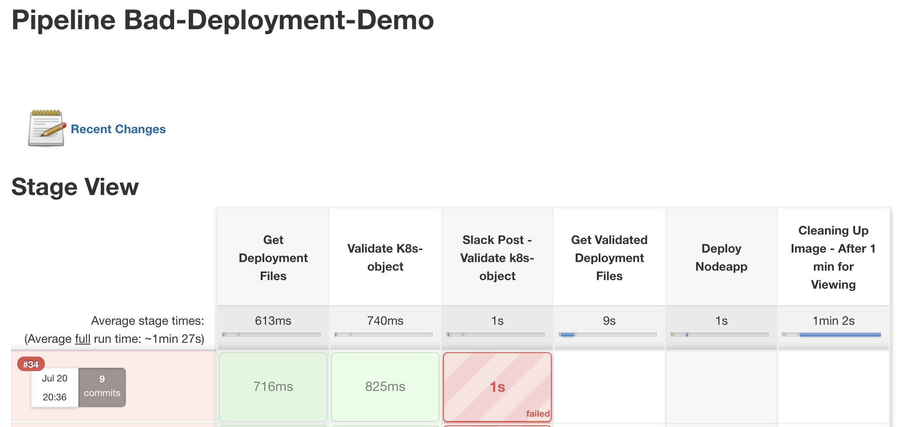
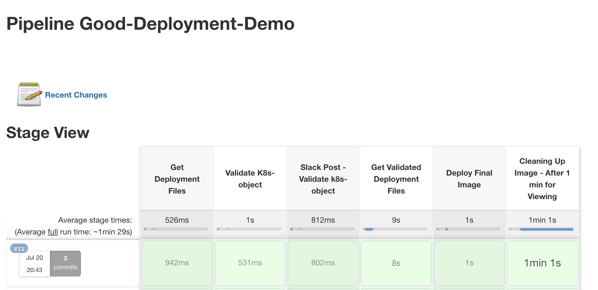

# CBC Container Demo artifacts

This demos two Jenkins-K8s deployments. It is intended to be imported, and work seamlessly, into the [CBC Container CI/CD Demo](https://github.com/ncomeau/CBC_Container_CICD_Demo) with minimal configuration. For more information regarding the process for importing this pipeline, please view the [K8Configs Main Branch Readme.md](https://github.com/JaBarosin/K8sConfigs/tree/main).

**Bad**
  - Jenkinsfile and deployment.yaml that violate CB Container policy rules

  

**Good**
  - Jenkinsfile and deployment-v2.yaml updated with additional configurations to satisfy CB Container policy rules

  
